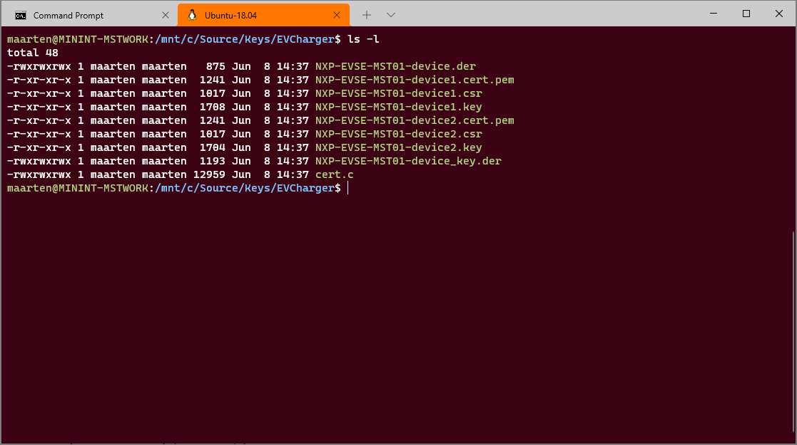

# Create a self-signed device certificate

Both IoT Hub and the Device Provisioning Service support shared access signatures (SAS) and X.509 certificates to secure the communication between a device and the application.
In this folder you will find a script to create a X.509 self-signed certificate in its own directory

Using CreateCerts scripts, we create a new device certificate that can be used for self-signed devices to connect either directly to an IoT Hub or to connect the device through a DPS service. Different devices have different ways to install the X.509 device certificates (in our samples typically in source code, in production this should be avoided and instead, be done through TPM or other HSM solutions).

## Introduction

We create a self-signed device certificate that will be added in PEM format to a device's firmware that uses the [Azure SDK for Embedded C](https://azure.github.io/azure-sdk-for-c/). These types of certificates are used to connect devices that run on Azure RTOS or other light weight Operating System or Middleware layer. These certificates are not meant to be used in a production environment but can accelerate PoC type of scenarios.

## Prerequisites

- WSL(2) with Ubuntu 18.04 or later installed
- Individual Enrollment created as described in [this document](https://docs.microsoft.com/en-us/azure/iot-central/core/how-to-connect-devices-x509#create-individual-enrollment)

In individual enrollments you don't need to install a root or intermediate X.509 certificate in your IoT Central application. Devices use a self-signed X.509 certificate to connect to your application.

## Generate a self-signed device certificate

Execute the script that can be found in this folder and pass a root-folder and a device name where the self signed device certificate will be created.

``` sh
./create-single-enrollment-azure-rtos.sh --root-folder /mnt/c/Source/Keys/mst01-tst --registration-id mst01
```

Executing the above shown script creates a new folder (it removes it first if a folder with the same name already exists) to store all certificate files in.

The script creates the following files in the specified folder:



The actual certificates (*.cert.pem) can be uploaded to a single DPS enrollment. The script also outputs certificate finger prints which can be uploaded to IoT Hub for device enrollment without DPS. The actual certificate and private key are also stored in the device firmware. For this reason they are converted to two different C arrays that can be found in the file ```cert.c```.

More information about [X.509 certificates can be found here](https://docs.microsoft.com/en-us/azure/iot-hub/tutorial-x509-introduction).

> NOTE: Make sure that you use the same name for device-id in the IoT Central application and the registration-id in the script. The registration-id can only contain alphanumerics and “-“ – but no spaces.

## Using OpenSSL

The workflow described here is good for test purposes and to secure IoT maker solutions. Here is a [nice simple article on using OpenSSL](https://blog.ipswitch.com/how-to-use-openssl-to-generate-certificates).
In Enterprise Environments, it is strongly advices to make use of X.509 certificates from a root certificate authority (CA).